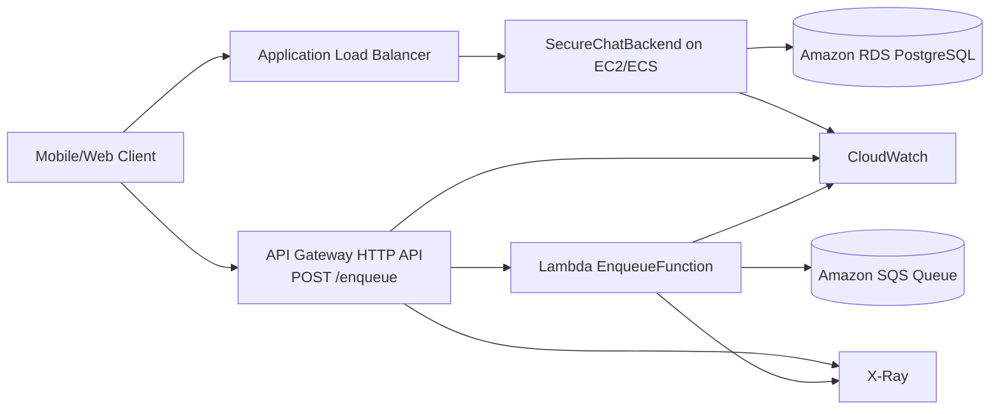
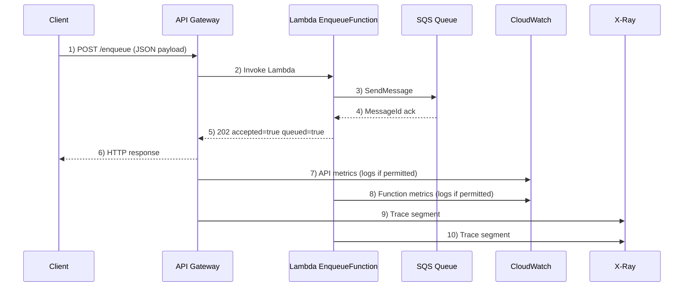

# Task #2 Architecture Blueprints (Old vs New)

Use this as the architecture section source for Part 1 and Part 3.

## Task #1 Baseline (Server-based)

## Task #2 Updated (Hybrid: Server-based + Serverless)

## Numbered Sequence (appendix-ready)

## Architecture changes from Task #1 to Task #2

1. Added a serverless ingestion path (`API Gateway -> Lambda -> SQS`) in parallel with the existing backend.
2. Kept core SecureChat app flow on EC2/ECS + RDS, while offloading one integration flow to Lambda.
3. Introduced queue-based decoupling with SQS to handle burst traffic more safely.
4. Expanded observability from EC2 metrics to include API Gateway/Lambda metrics and X-Ray traces (CloudWatch Logs only when IAM permissions allow).

## Why this design fits the brief

- Uses required serverless components: API Gateway + Lambda
- Integrates at least one required AWS service: SQS
- Includes monitoring tools for performance analysis: CloudWatch + X-Ray

## Learner Lab constraints (document in report)

In Learner Lab, some IAM/X-Ray admin APIs are restricted (for example `iam:GetPolicy`, `iam:CreateRole`, `xray:GetIndexingRules`, `xray:GetTraceSegmentDestination`). CloudWatch Logs access can also be limited by role policy. Because of this, report evidence focuses on available views:

- CloudWatch metrics (EC2/API Gateway/Lambda)
- X-Ray service map + trace timelines
- Functional proof (`POST /enqueue` + SQS message receipt)
- Optional only if accessible: CloudWatch log groups/log streams and advanced X-Ray settings pages

## Discussion prompts (copy into report)

- Why serverless was introduced and what flow it handles.
- How SQS improves decoupling and resiliency under spikes.
- Cost and operations tradeoff: always-on EC2/ECS vs pay-per-use Lambda.
- Monitoring differences between baseline architecture and hybrid architecture.
