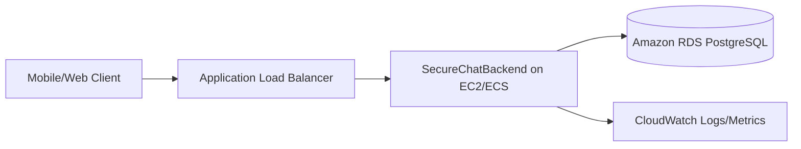
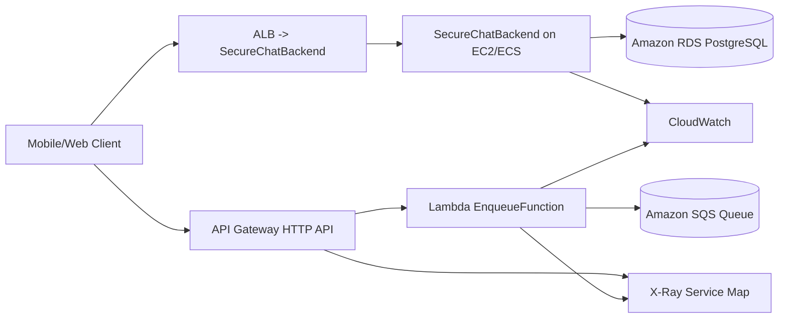

# Task #2 Architecture Blueprints (Old vs New)

Use these as editable templates for Part 1 and Part 3 report content.

## Task #1 Baseline (Server-based)

## Task #2 Updated (Hybrid with Serverless)

## Discussion prompts (copy into report)

- Why serverless was added and which flow was moved to Lambda.
- How SQS decouples traffic spikes from processing.
- Cost/ops tradeoff between always-on EC2 service and pay-per-use Lambda.
- Monitoring differences: EC2 metrics/logs vs Lambda/X-Ray traces.
